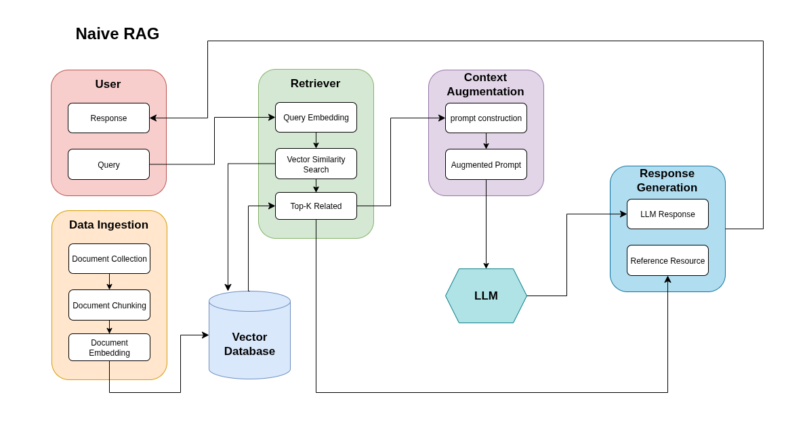
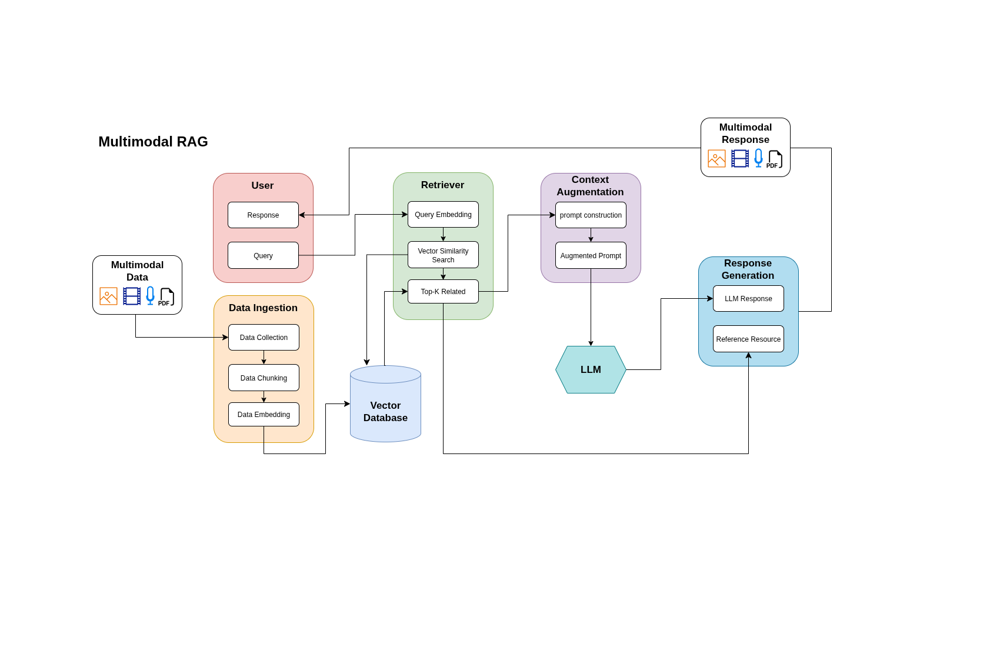

# Universal RAG Architectures: A Playground

This project is a hands-on playground designed to implement, compare, and showcase various **Retrieval-Augmented Generation (RAG)** architectures. Its goal is twofold:
1.  To serve as a **technical portfolio piece** demonstrating the ability to build and deploy sophisticated RAG systems from the ground up.
2.  To act as an **educational resource** that clearly explains the core ideas, strengths, weaknesses, and ideal use cases for each architecture.

---

## The Foundation: Why Chunking is Critical

Before retrieval, documents must be broken into smaller pieces, or "chunks." This is arguably the most critical step in a RAG pipeline, as the quality of the chunks directly impacts the quality of the retrieval and, ultimately, the final answer.

### Common Chunking Strategies

* **Fixed-Size Chunking:** The simplest method. The text is split into chunks of a fixed character or token length (e.g., 1000 characters).
    * **Pros:** Easy and fast to implement.
    * **Cons:** Can awkwardly cut sentences or separate related ideas, leading to loss of context.
    * **Used in:** Our **Naive RAG** as a baseline.

* **Semantic Chunking:** A more intelligent method. The text is first split into sentences. Then, using embeddings, it groups semantically related sentences into a single chunk. A split occurs only when the topic changes.
    * **Pros:** Creates contextually coherent chunks that are topically consistent.
    * **Cons:** More computationally expensive than fixed-size chunking.
    * **Used in:** Our **Retrieve-and-Rerank RAG** to provide higher-quality documents to the reranker.

* **Document-Based (Structural) Chunking:** This strategy leverages the inherent structure of a document, such as Markdown headers, HTML tags, or sections in a PDF. Each section or sub-section becomes a chunk.
    * **Pros:** Highly effective for structured documents, preserving the author's intended layout of information.
    * **Cons:** Not suitable for unstructured text like plain narratives.

---

## Architectures Implemented

Below is a comparison of the different RAG systems built in this repository.

### 1. Naive RAG

* **Core Idea:** The most basic RAG approach. It chunks documents, creates vector embeddings for each chunk, and stores them in a vector database. At query time, it finds the top-k most similar chunks to the user's question based on vector similarity.
* **Strengths:** Simple to build, fast, and works well for simple Q&A on a single set of documents.
* **Weaknesses:** Prone to retrieving irrelevant or low-quality chunks, as "semantic similarity" doesn't always equal "relevance."
* **When to Use:**
    * Quick prototypes and proof-of-concepts.
    * Simple Q&A bots over a well-defined and clean knowledge base.

### 2. Retrieve-and-Rerank RAG

* **Core Idea:** An improvement on Naive RAG that adds a second filtering stage. It first retrieves a larger number of documents (e.g., 10-20) and then uses a more powerful, slower model (a **reranker**) to score and re-order these documents based on their actual relevance to the query.
* **Strengths:** Significantly higher precision and accuracy than Naive RAG. The context passed to the LLM is much more relevant.
* **Weaknesses:** Slightly higher latency due to the second reranking step.
* **When to Use:**
    * When the quality and accuracy of the answer are critical (e.g., customer support bots, enterprise search).
    * When the initial retrieval brings back too much "noise."

### 3. Graph RAG

* **Core Idea:** Instead of searching over text chunks, this approach retrieves information from a **Knowledge Graph** (like Neo4j). An LLM translates the user's question into a structured graph query (e.g., Cypher), which then traverses the network of nodes and relationships to find precise answers.
* **Strengths:** Unmatched at answering complex, multi-hop questions that require understanding relationships between entities (e.g., "Which movies were directed by someone who also acted in a movie with Tom Hanks?").
* **Weaknesses:** Requires the data to be structured and modeled as a graph, which involves a more complex ingestion process.
* **When to Use:**
    * Fraud detection, supply chain analysis, and recommendation engines.
    * Querying highly interconnected data like organizational charts, movie databases, or scientific research.

### 4. Hybrid RAG (with ELSER)

* **Core Idea:** Fuses the results from two different search methods in parallel: **Vector Search** (for conceptual meaning) and **Lexical Search** (for specific terms). The two ranked lists of results are then combined using Reciprocal Rank Fusion (RRF) to produce a single, highly relevant final list.

* **The ELSER Advantage:** Instead of using a traditional keyword search like BM25, this implementation uses **ELSER**, Elastic's state-of-the-art sparse vector model. ELSER understands context and synonyms (like a vector search) but operates with the efficiency of a lexical search, providing superior relevance for a wide range of queries.

* **Strengths:** Extremely robust and accurate. It mitigates the weaknesses of each individual search method, catching both specific keywords that vector search might miss and broad concepts that keyword search can't understand.

* **Weaknesses:** More complex infrastructure (requires both a vector and keyword index). Slightly higher query latency than a single-retriever system.

* **When to Use:** The gold standard for production-grade enterprise search and complex Q&A systems. Ideal for technical documentation, e-commerce, and any domain where user queries can be both specific and vague.

### 5. Multimodal RAG

* **Core Idea:** This architecture expands the RAG pipeline beyond just text to include other data types, primarily images. Using a shared embedding space, it can retrieve relevant images based on a text query (or vice versa).
* **Our Implementation:** We use a foundational approach where rich text descriptions of images are embedded and stored in a vector database. Each vector is linked to its corresponding image file. The system retrieves the most semantically similar description and then presents the associated image as the result.
* **Strengths:** Allows for powerful cross-modal search (text-to-image). Unlocks the ability to query vast libraries of visual data with natural language.
* **Weaknesses:** Our current implementation relies on the quality of the text descriptions rather than analyzing the image pixels directly. More advanced models like CLIP can create embeddings from the image itself for even greater accuracy.
* **When to Use:**
    * **E-commerce:** "Show me blue formal shirts similar to this picture."
    * **Intelligent Tech Support:** A user uploads a screenshot of an error, and the system retrieves the correct troubleshooting guide.
    * **Content Discovery:** Finding relevant images, diagrams, or charts within a large database of documents.

### 6. Agentic RAG (Router)

* **Core Idea:** Uses an LLM-powered **agent** to act as an intelligent "smart dispatcher." Given a query, the agent's first step is to *reason* about the nature of the question and then *select the most appropriate retrieval tool* from a toolkit. For example, it might route a question about relationships to the Graph RAG pipeline and a question about general concepts to the Vector RAG pipeline.
* **Strengths:** Highly flexible and robust. It can handle a wide variety of questions by dynamically choosing the best way to find an answer. It's easily extensible with new tools (e.g., adding a web search tool).
* **Weaknesses:** Increased complexity and latency due to the agent's reasoning step. Can be more expensive due to the extra LLM call for routing.
* **When to Use:** Advanced enterprise assistants that need to answer questions from many different types of data sources (vector, graph, relational databases, web, etc.).

---

## Tech Stack
- Python, FastAPI
- LangChain, LlamaIndex
- Qdrant (vector DB)
- Neo4j (graph DB)
- Elasticsearch (BM25 hybrid search)
- Streamlit/Gradio (demo UI)
- Docker Compose (infrastructure)
